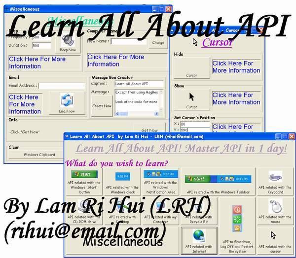



## Learn All About API

### Description

If 'API' is a new word to you or you just heard about API but don't know how to use it yet, this program is absolutely for you. This program contains ton of API example. It can be considered as a library of API. The range of API use is very wide; from hiding and showing taskbar and desktop to advance internet related API. This program also has a graphical interface that is easy to use. There is a 'Click Here for More Information' button at each code. Click the button and you will get information about that API call. If you have a look at this program, you will not be disappointed. Please give comments about this program. Also, please vote for my work.
 
### More Info
 

             |
---                |---
**Submitted On**   |2003-10-10 09:27:40
**By**             |[Lam Ri Hui](https://github.com/Planet-Source-Code/PSCIndex/blob/master/ByAuthor/lam-ri-hui.md)
**Level**          |Beginner
**User Rating**    |4.8 (139 globes from 29 users)
**Compatibility**  |VB 4\.0 \(16\-bit\), VB 4\.0 \(32\-bit\), VB 5\.0, VB 6\.0
**Category**       |[Windows API Call/ Explanation](https://github.com/Planet-Source-Code/PSCIndex/blob/master/ByCategory/windows-api-call-explanation__1-39.md)
**World**          |[Visual Basic](https://github.com/Planet-Source-Code/PSCIndex/blob/master/ByWorld/visual-basic.md)
**Archive File**   |[Learn\_All\_16573710122003\.zip](https://github.com/Planet-Source-Code/lam-ri-hui-learn-all-about-api__1-49037/archive/master.zip)

